# [Create a new app in your tenant](#create-an-app)

Follow the steps below once to create an app that can be used from the GT365 API.

- Login to the Azure Portal as Global Admin and navigate to [Active Directory / App registrations](https://portal.azure.com/#blade/Microsoft_AAD_IAM/ActiveDirectoryMenuBlade/RegisteredApps). 
- Click on "New registration"

- Enter a name, such as "GovernanceToolkit365ProvisionGroup" or similar and click "Register".
[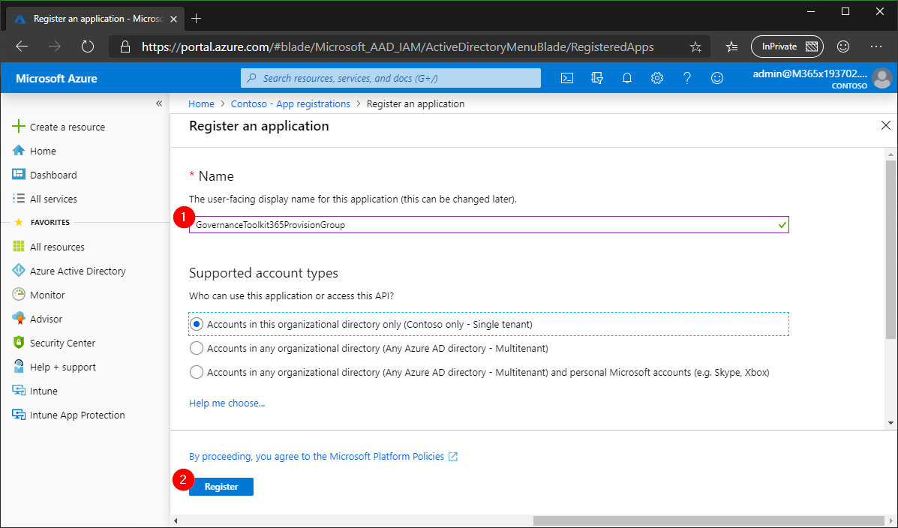](./images/app-registration-2.png "Click to enlarge")
- Once the app is created, click on "Certificates and secrets" and on the button "New client secret"
[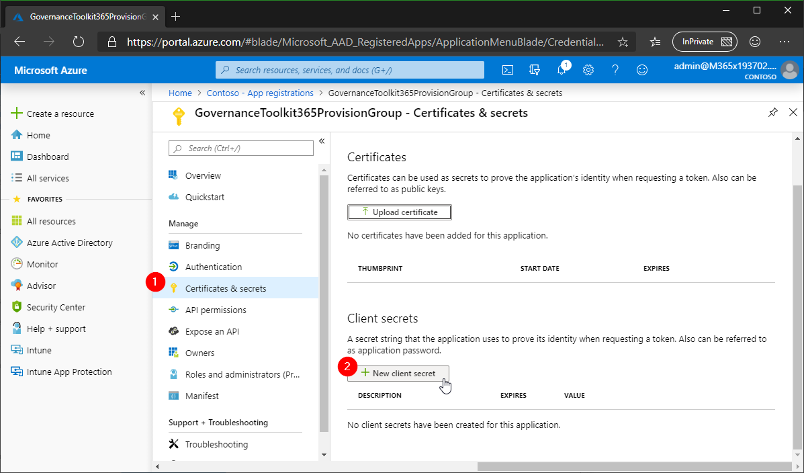](./images/app-registration-3.png "Click to enlarge")
- Enter a name, such as "secret", select the expiration time (usually 1 or 2 years) and click "Add".
[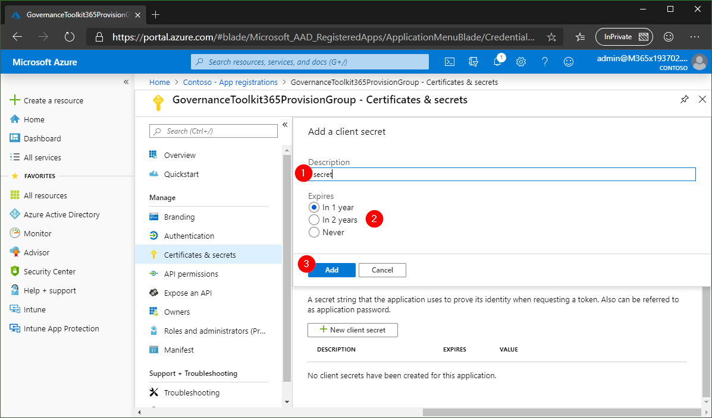](./images/app-registration-4.png "Click to enlarge")
- Copy the generated value (the secret) and save it in a safe place. You need that later.
[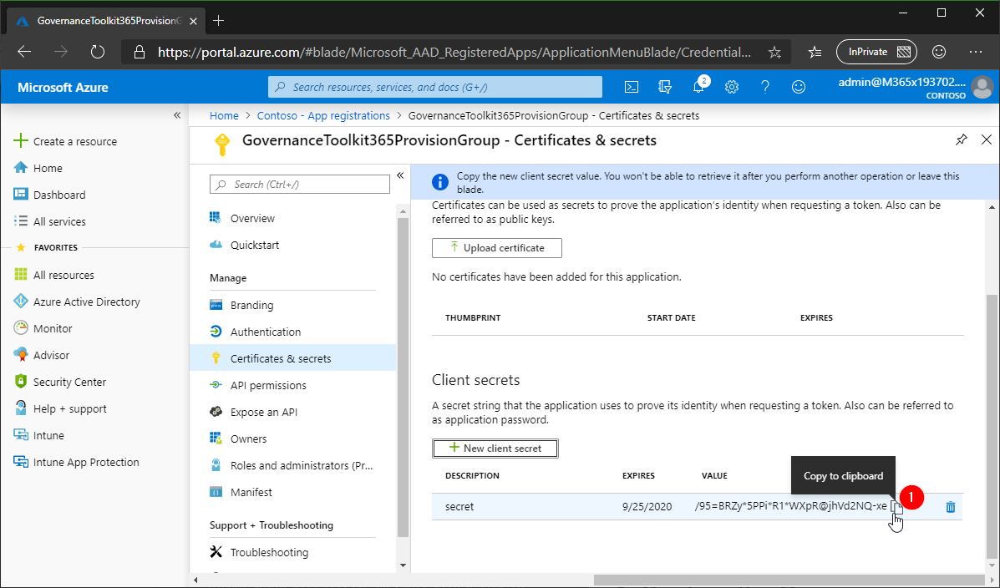](./images/app-registration-5.png "Click to enlarge")
If the secret gets compromised, delete the old and generate a new secret.
- Click on "API permissions" and on the "Add a permission" button.
[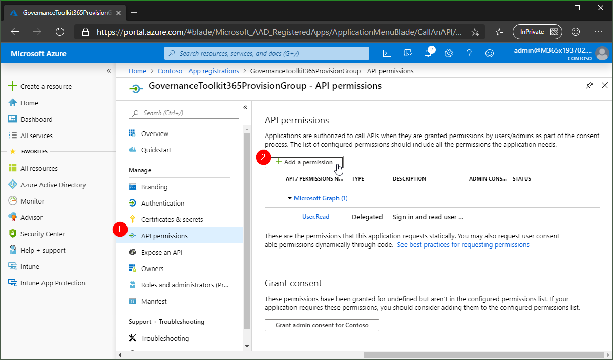](./images/app-registration-6.png "Click to enlarge")
- Click on the "Microsoft Graph" provider.
[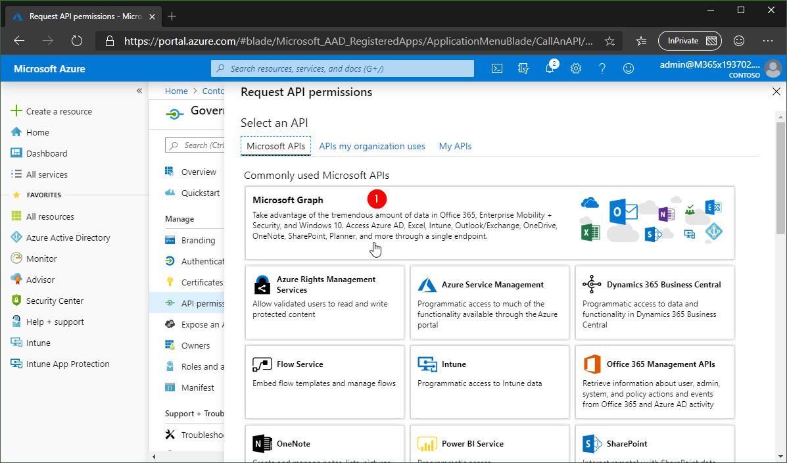](./images/app-registration-7.png "Click to enlarge")
- Click on "Application permission".
[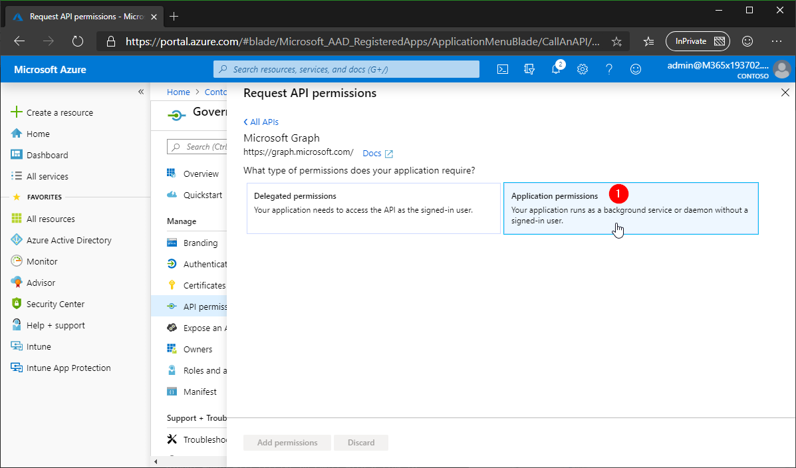](./images/app-registration-8.png "Click to enlarge")
- Search for "group". In the group section, find the "Group.ReadWrite.All" permission and select it. This permission is required to read and to create new groups and teams.
[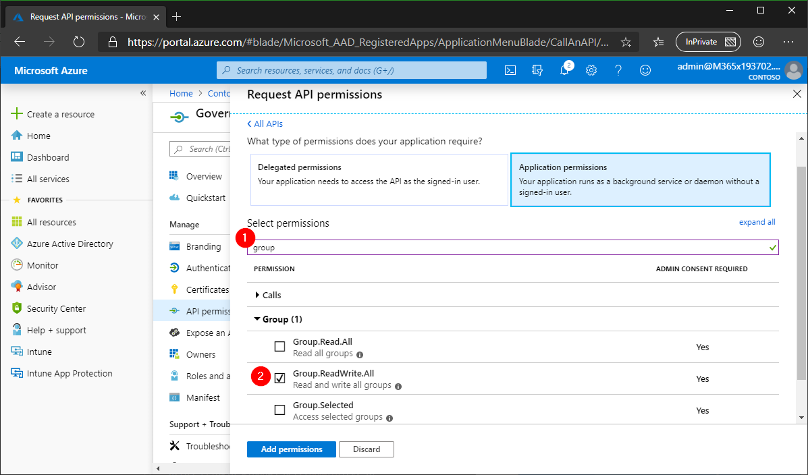](./images/app-registration-9.png "Click to enlarge")
- Search for "user". In the user section, find the "User.Read.All" permission and select it. This is required to add owners to a new group. Then, click "Add permissions" to save the settings.
[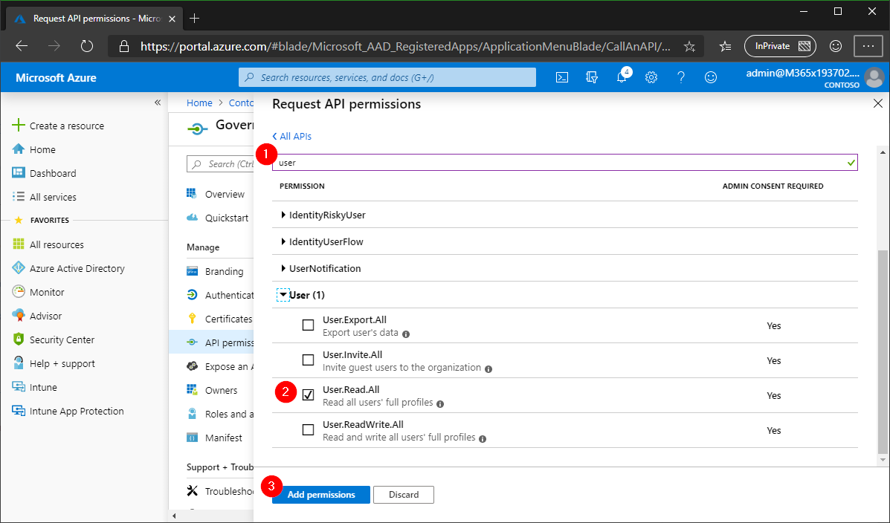](./images/app-registration-10.png "Click to enlarge")
- Check the permissions, they should set as in the following screenshot. Wait for up to 10 seconds, then click "Grant admin consent for [your organization]". This allows this application to execute tasks with the defined permissions.
[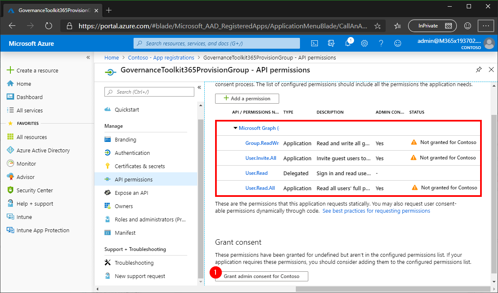](./images/app-registration-11.png "Click to enlarge")
- Confirm the consent "Do you want to grant consent for the requested permissions for all accounts in Contoso? This will update any existing admin consent records this application already has to match what is listed below."
[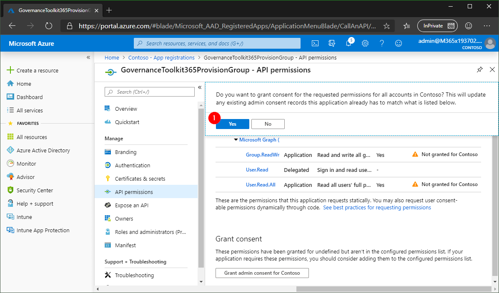](./images/app-registration-12.png "Click to enlarge")
- The application permissions should be granted now and look as here.
[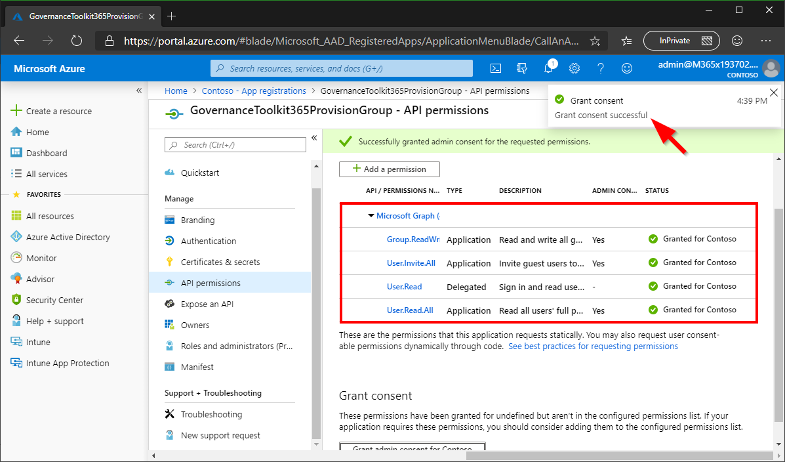](./images/app-registration-13.png "Click to enlarge")
- We need to copy the AppID and the TenantID together with the secret. We need that data later.
[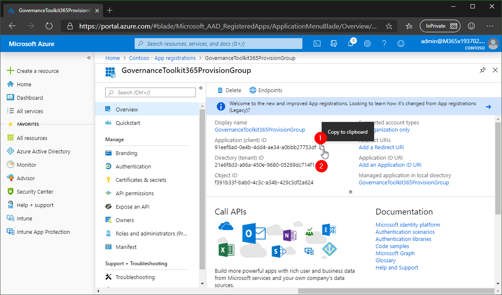](./images/app-registration-14.png "Click to enlarge")
- Done with the app registration. This is a one-time step. We can now work with that app.

You should now have the app data saved somewhere, similar as here:

| Key | Value |
|:----|:------|
| AppID | 91eef8ad...
| AppSecret | /95=BRZ...
| TenantID | 21e6f8d3...

Continue to use the API at [Use the API](./API-provisioning.md).

**Quick navigation**
[ReadMe](./readme.md) &middot; [API](-/API.md) &middot; [API-Create-App](./API-create-app.md) &middot; [API-Provisioning](./API-provisioning.md) &middot; [Newsletter](./newsletter.md) &middot; [Power-BI](./power-bi.md) &middot; [GT365](https://governancetoolkit365.com/)