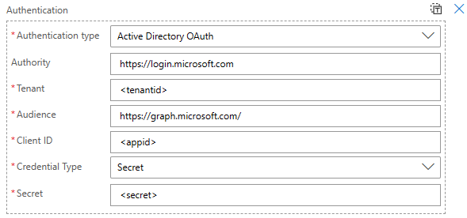
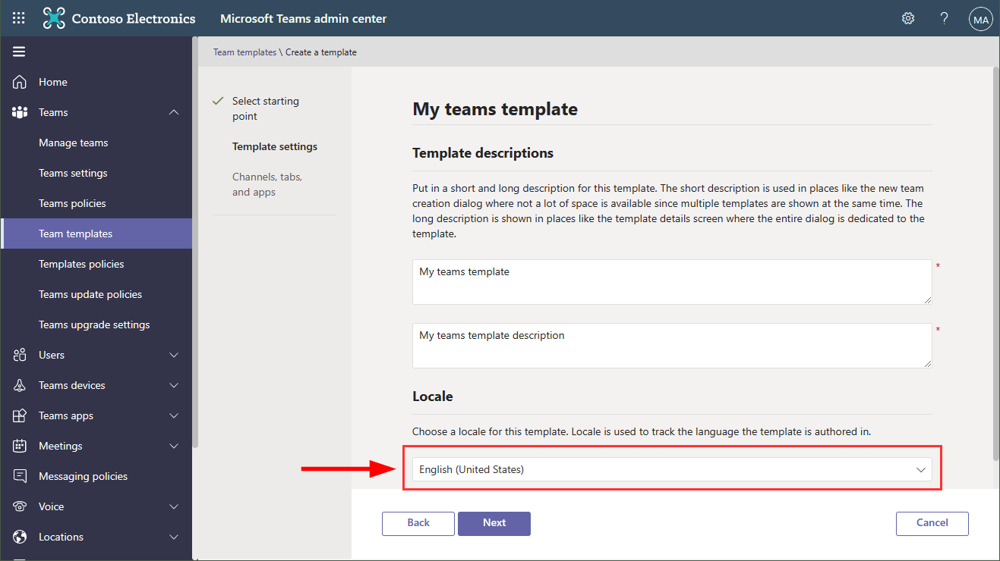
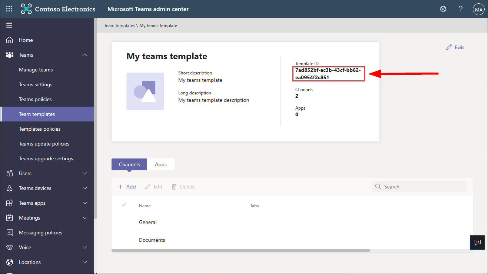

# [Provision Team](#provision-team)

Add the method to the **API base url**, see [API](./API.md). The following authentication must be provided in every GT365 API call, see [API-Create-App](./API-create-app.md).

## POST /api/ProvisionTeam

The ProvisionTeam method allows to provision a new Microsoft Team based on a given Microsoft Teams Template. 

Use this exact sample payload as the **body** and adjust it as needed:

~~~~json
{
    "displayName": "My Team 11",
    "mailNickname": "myteam11",
    "description": "This is my project team 11",
    "ownerUPNs": ["nestorw@M365x193702.onmicrosoft.com",
                  "biancap@M365x193702.onmicrosoft.com"],
    "memberUPNs": ["christiec@M365x193702.onmicrosoft.com",
                   "raulr@M365x193702.onmicrosoft.com"],    
    "visibility": "Private",
    "classification": "General",
    "templateId": "7ad852bf-ec3b-43cf-bb62-ea0954f2c851"
}
~~~~

## Specifications

- If you want to create a new team, we recommend to use this method.
- If no templateId is provided, the "standard" Teams Template is used (as in the ProvisionGroup method). The Standard Teams Template is the default (blank) template that is used, when a user creates a new, empty team.
- To get a teams templateId, see below.
- At least one *ownerUPN* email must be provided. 
- If you do not want to add members in this step, provide an empty array: *"memberUPNs": []*. 
- *visibility* can be *private* or *public*. If no visibility is set, the Team will become a private Team. 
- The *classification* can be an empty string "" or can be omitted.
- The process usually takes at least 20 seconds, but can also take longer depending on the workload of the Microsoft 365 API.

## How to create a new teams template

- As Administrator, open https://admin.teams.microsoft.com/teams/templates
- This opens the Team templates admin page. Click "Add"
- In the "Select a starting point for your new template" page, select "Create a new template" and click "Next"
- Add a template name and a description. **Ensure, you select the "Locale" with the option "English (United States)"**. This is essential! Currently, **only templates with that locale (en-US) can be used!** The Microsoft Product Group is aware of that issue, but currently this is the only workaround when using the API. Be aware, you cannot modify the Locale after the template has been created. Compare with the screenshot below.
- Continue to configure the channels and apps in that template. Finalize and click "Submit".

**Important:** The Locale "English (United States)" must be used. Otherwise, the creation of a new team will throw an error.

## How to get a teams template Id

- As Administrator, open https://admin.teams.microsoft.com/teams/templates
- This opens the Team templates admin page. In the list, click on the desired teams name
- Find the teams template id under the Template ID label in the first box. See the following screenshot.

## Samples

See some samples here.

### Sample 1 - Create a standard team

This is the minimal data that must be provided.

~~~~json
{
  "displayName": "My Team 11",
  "mailNickname": "myteam11",
  "description": "This is my project team 11",
  "ownerUPNs": ["nestorw@M365x193702.onmicrosoft.com"],
  "memberUPNs": [ ]
}
~~~~

### Sample 2 - Create a team from a template

~~~~json
{
  "displayName": "My Team 12",
  "mailNickname": "myteam12",
  "description": "This is my project team 12",
  "ownerUPNs": ["nestorw@M365x193702.onmicrosoft.com",
                "biancap@M365x193702.onmicrosoft.com"],
  "memberUPNs": ["christiec@M365x193702.onmicrosoft.com"],    
  "visibility": "Public",
  "classification": "",
  "templateId": "7ad852bf-ec3b-43cf-bb62-ea0954f2c851"
}
~~~~

### Return codes

The method returns a HTTP Statuscode with a result. If the operation was successful, *HTTP 201 Created* is returned. If data is missing or incorrect, a *HTTP 400 Bad Request* follows. If another error occurs, a Statuscode *HTTP 500 Internal Server Error* is returned. You can react on the HTTP Statuscode.

The return result is as follows. 

~~~~json
{
  "id": "b385f8dc-3487-4123-a7df-d62123effeb8",
  "displayName": "My Team 12",
  "type": "Team",
  "error": "",
  "message": "Team My Team 12 was successfully created."
}
~~~~

The *id* is the new group Id (that can be used for other operations).The  type is *Group* or *Team*. *error* includes any error message.

## Quick navigation

[ReadMe](https://github.com/delegate365/GovernanceToolkit365/) &middot; [API](./API.md) &middot; [API-Create-App](./API-create-app.md) &middot; [API-Provision-Team](./API-provision-team.md) &middot; [API-Provision-Group](./API-provision-group.md) &middot; [API-Provision-Group-Flow](./API-provision-group-flow.md) &middot; [API-Invite-Guests](./API-invite-guest.md) &middot; [Newsletter](./newsletter.md) &middot; [Power-BI](./power-bi.md) &middot; [GT365](https://governancetoolkit365.com/)
