# Governance Toolkit 365

The Governance Toolkit 365 (GT365) provides a compliance coverage across multiple workloads. The toolkit runs as Software-as-a-Service and automatically requests usage data from the Microsoft 365 services and delivers summarized and detailed information to custom users and administrators.

Additionally, the Governance Toolkit 365 provides an API for provisioning a new Microsoft 365 Group or a new Microsoft Team. See a feature overview at [www.governancetoolkit365.com](https://governancetoolkit365.com/).

## Setup

The GT365 is provided as SaaS solution. Depending on the planned usage, you can use the reporting part only, the newsletters and the API if required. The  onboarding includes these steps.

1. Open the [www.governancetoolkit365.com](https://governancetoolkit365.com/) website. At the end, there´s a Register link. Open that link.
2. Fill out the form and ensure that you enter **your email address and a valid Microsoft 365 domain**. The domain name is usually your email address domain, such as "contoso.com". Then, submit the form. When submitted, you will see a confirmation such as "Thank you for submitting your request. You will receive an email when the approval is done.".

[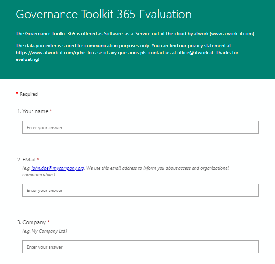](./images/register-1 "Click to enlarge")

[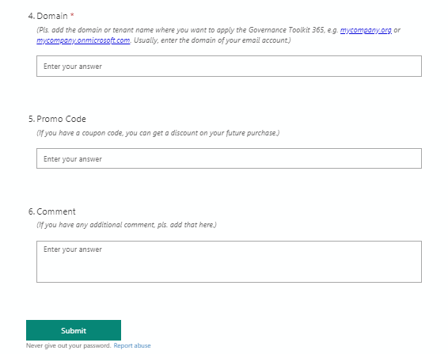](./images/register-2 "Click to enlarge")

4. The request will be manually approved usually within one business day. You will receive an email with the subject "GT365: Welcome! Pls. grant the app consent: {your-domain}".
Send this email (or the provided [link](https://bit.ly/gt365app)) to a Global Administrator of your Microsoft 365 tenant.

[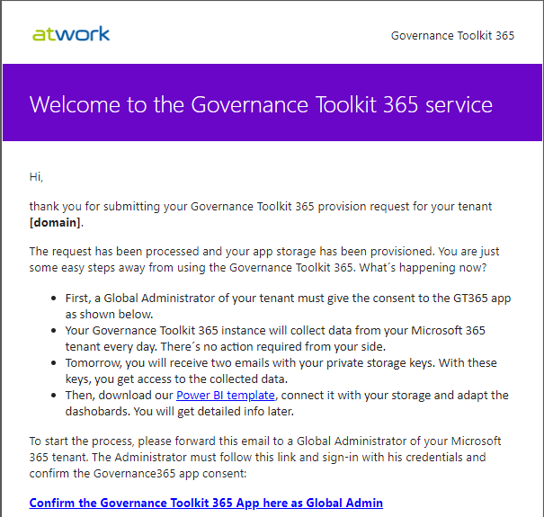](./images/setup-1.png "Click to enlarge")
[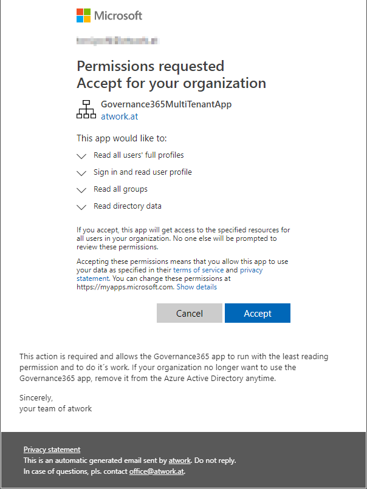](./images/setup-1b.png "Click to enlarge")

5. A Global Admin must open that link and confirm the app access.When working with multiple identities, we recommend to open the link in a browser In-Private mode.

[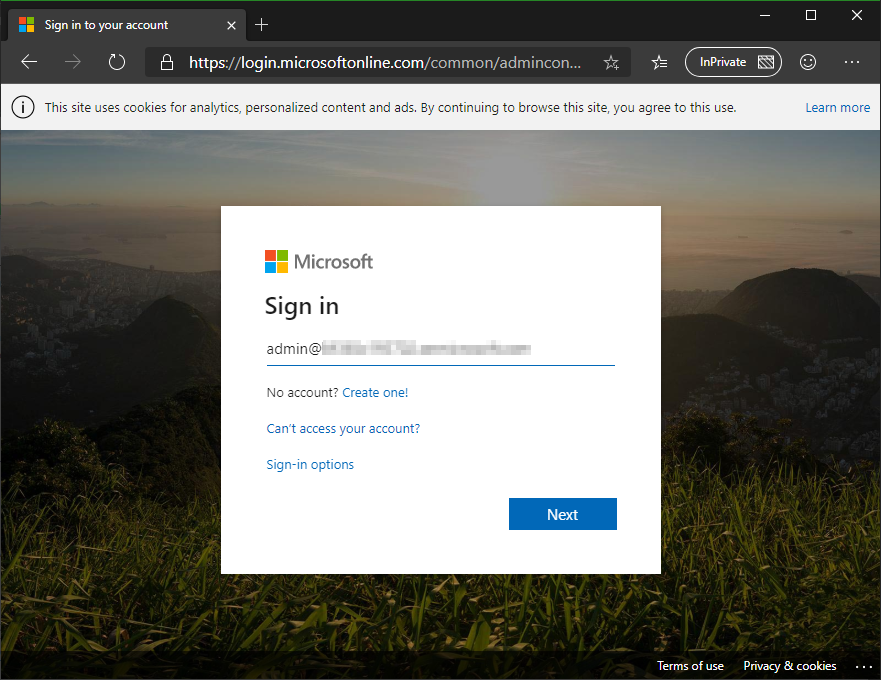](./images/setup-2 "Click to enlarge")

Sign-in with the Global Admin and the password (and additional sign-options if configured). After the login, click "Accept" the Governance Toolkit 365 app.

[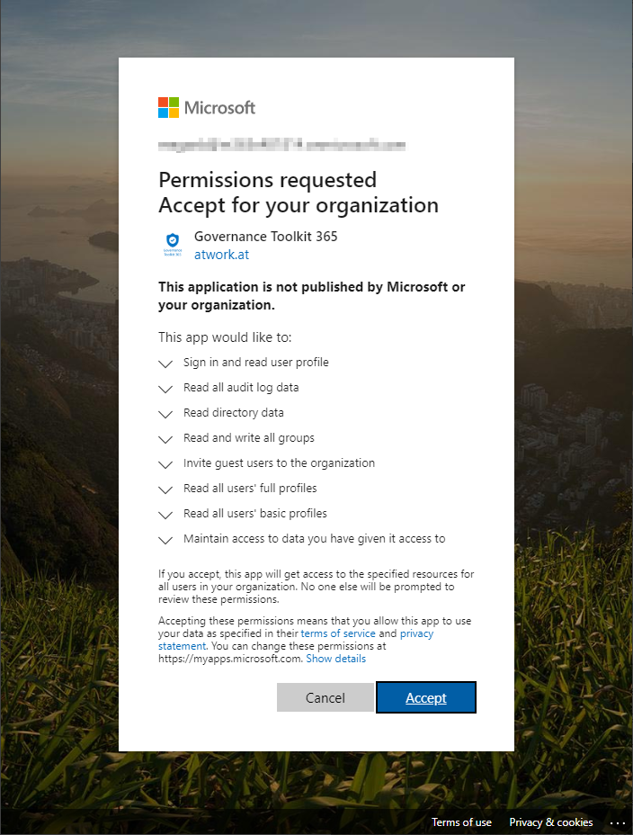](./images/setup-3 "Click to enlarge")

The app only asks for the least privilege permissions. It needs to read  directory data, groups and users and permissions for provisioning groups and to invite guests. You will be redirected to a confirmation page.

[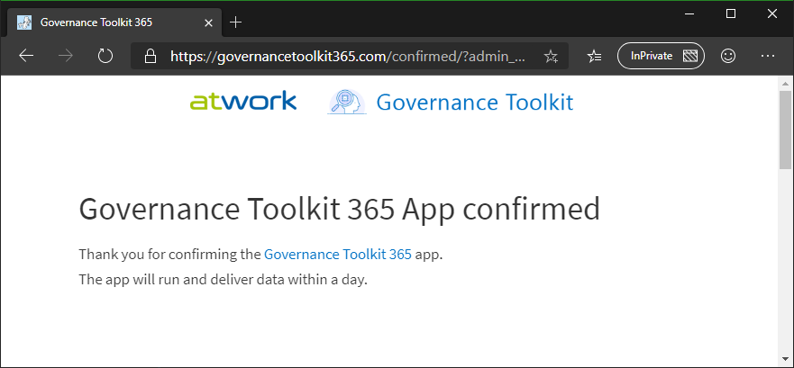](./images/setup-4 "Click to enlarge")

You can close the page or the browser.

6. Now the GT365 app is allowed to access the tenant. The statistics generation is done during the night. So, you will receive emails with the Storage Account access data on the next day automatically. Wait for that emails. They contain the Storage name and key, similar as in the following screenshots.
The first email has the subject "GT365: Your storage for "{your-domain}" and contains the Storage Account name.

[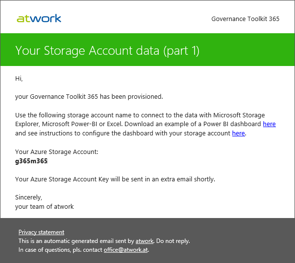](./images/setup-5 "Click to enlarge")

The second email has the subject "GT365: Your storage data part two" and contains the (long) Storage Account key.

[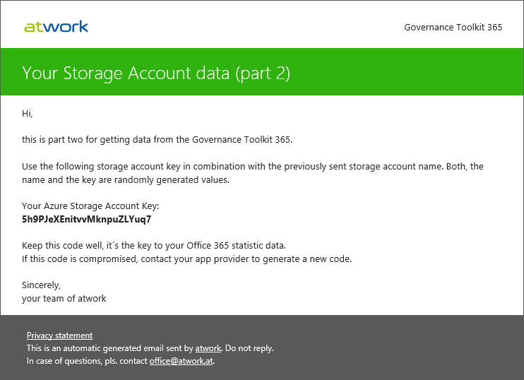](./images/setup-6 "Click to enlarge")

Note that all data is stored in a secure place. You need that for accessing the daily generated data. The keys are randomly generated.

## Usage

- Access the data with the Storage Account name and key with a client tool, such as [Power BI](https://powerbi.microsoft.com/en-us/downloads/). You can download a GT365 dashboard sample zip-file from [here](https://governancetoolkit365.com/download/GovernanceToolkit365-Template.zip). (do not forget to [change the datasource](./power-bi-datasource.md) for the sample dashboard)
- Adapt the Power BI dashboard as needed. See some sample dashboards here: 

[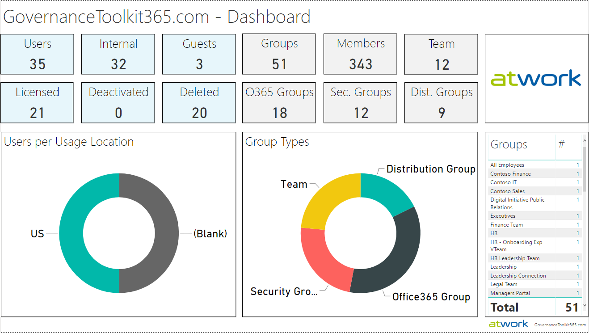](./images/bi-demo-1 "Click to enlarge")

[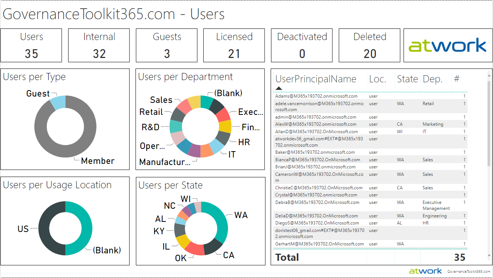](./images/bi-demo-2 "Click to enlarge")

[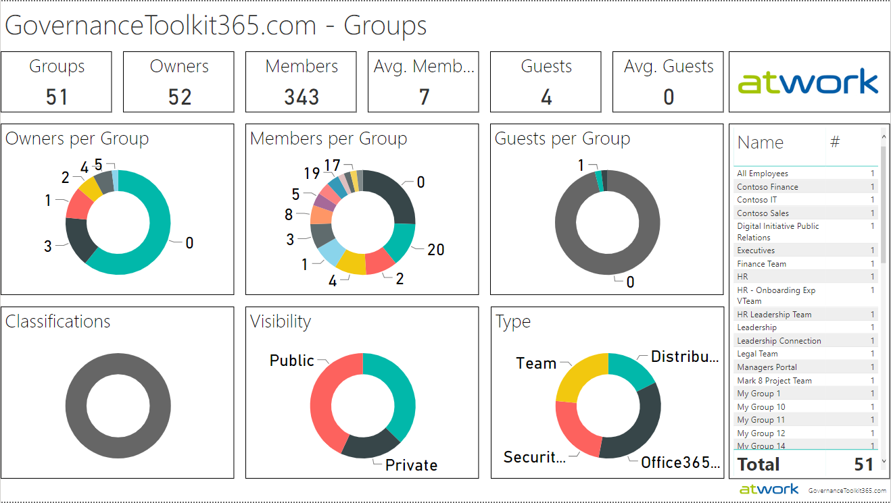](./images/bi-demo-3 "Click to enlarge")

[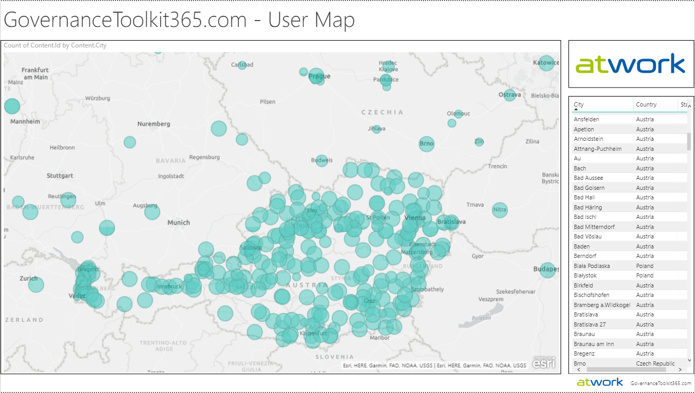](./images/bi-demo-4 "Click to enlarge")

[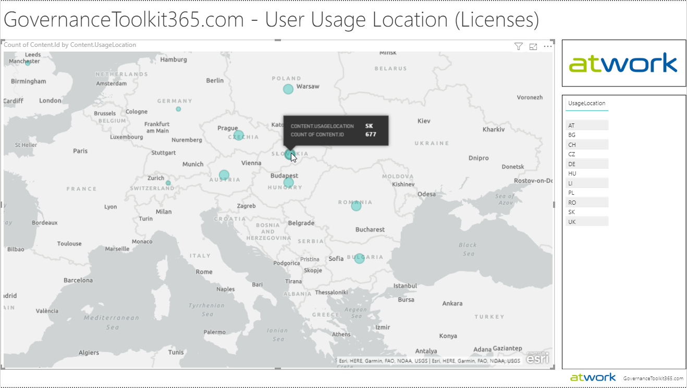](./images/bi-demo-5 "Click to enlarge")

[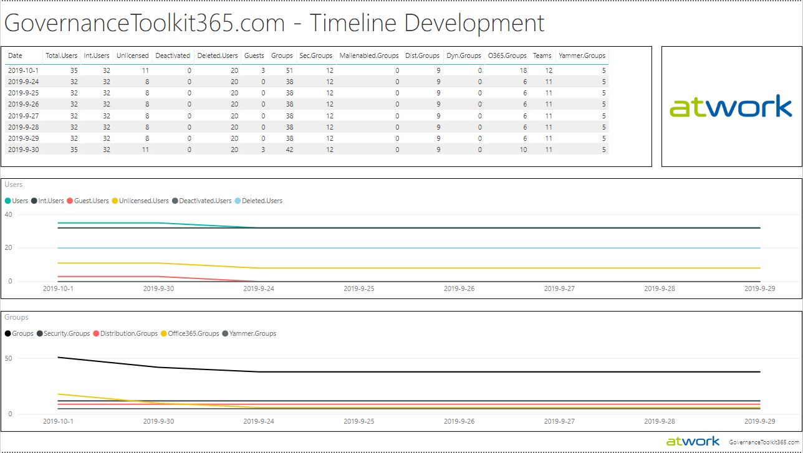](./images/bi-demo-6 "Click to enlarge")

## Setup newsletters (optional)

Automatic newsletters inform about orphaned groups and guest access. 
If you want to use automatic newsletters, follow these steps described at [Newsletter](./newsletter.md).

## Use the API (optional)

The API allows to provision a new group out of an application or a workflow. 
If you want to use the GT365 API, follow these steps described at [API](./API.md).

## Security in GT365

Security is an important topic for any system. We care about security and privacy. 
The concept of GT365 is to work with least privileges and without storing any user credentials. So, a Global Admin has to allow access for the GT365 app to read directory data and groups. This creates an application in the customer´s Microsoft 365 tenant that the GT365 can use programmatically and generate the statistics for that tenant. After the app access has been granted, the customer receives a private Storage Account key to get access to the generated data.

When using the API, the GT365 expects a valid token from the customer´s tenant to provision a new Microsoft 365 Group or Team. The token grants access only to provision a group with the required user data. The token is usually valid just for up to one hour and expires then.

GT365 never stores any user credentials. To remove the access, the GT365 app can be removed in the customer´s tenant anytime.

Enjoy!

## Quick navigation

[ReadMe](https://github.com/delegate365/GovernanceToolkit365/) &middot; [API](./API.md) &middot; [API-Create-App](./API-create-app.md) &middot; [API-Provisioning](./API-provision-group.md) &middot; [API-Provisioning-Flow](./API-provision-group-flow.md) &middot; [API-Invite-Guests](./API-invite-guest.md) &middot; [Newsletter](./newsletter.md) &middot; [Power-BI](./power-bi.md) &middot; [GT365](https://governancetoolkit365.com/)
