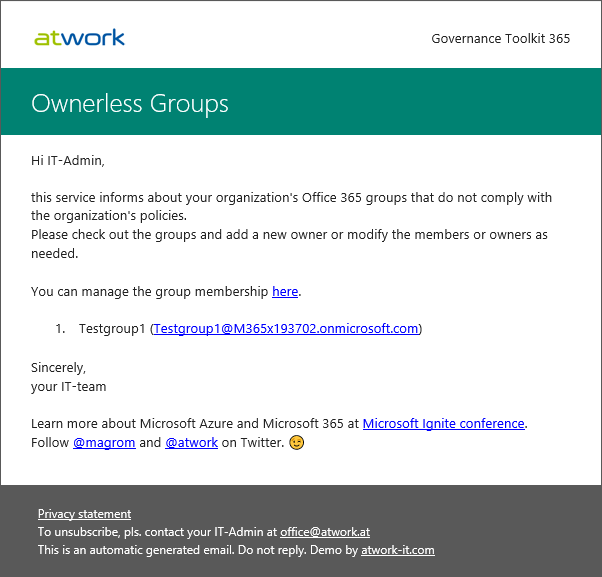
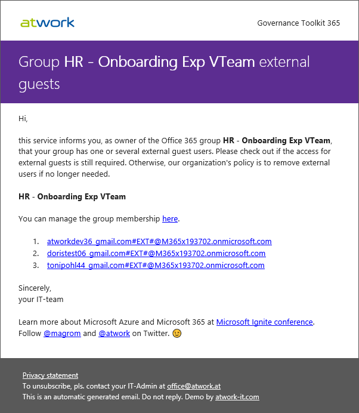
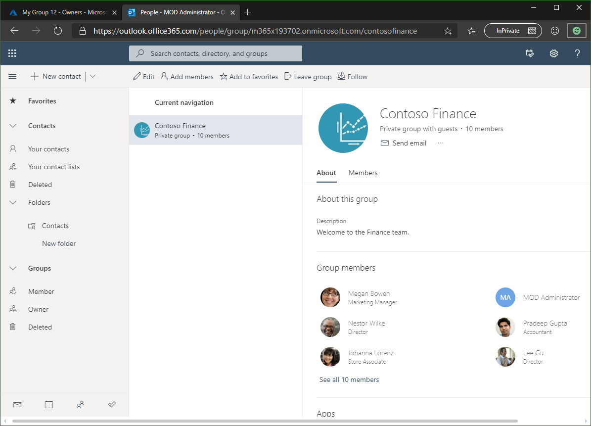

# Newsletter

This page informs about how to use the Governance Toolkit 365 (GT365) and the built-in newsletter system.

The GT365 newsletters can be sent automatically to predefined admins or group owners. Currently, there are these newsletters available:

- Ownerless Groups
- Group Guests

Each newsletter can be sent to a group of Administrators on a daily, weekly or monthly basis. The subject and the email body can be defined as needed. To configure the newsletter, download the newsletter templates and contact atwork for setting the desired configuration.

## Ownerless Groups

If configured, the defined administrators receive a newsletter showing all orphaned groups, similar as here.

You can download this sample owenerless groups newsletter [here](./newsletter/OwnerlessGroups.html) and adapt it.

## Group guests

If configured, the defined administrators and the team owners receive a newsletter showing all guests per groups, similar as here.

You can download this sample groups guests newsletter [here](./newsletter/GroupGuests.html) and adapt it.

To modify the team members, follow the appropriate link to Outlook for the web. There, the members and owners of the current group chan be modified as needed.

Pls. send an email to support-at-atwork.at for setting the configuration for your environment.

**Quick navigation**

[ReadMe](https://github.com/delegate365/GovernanceToolkit365/) &middot; [API](./API.md) &middot; [API-Create-App](./API-create-app.md) &middot; [API-Provisioning](./API-provisioning.md) &middot; [API-Invite-Guests](./API-invite-guest.md) &middot; [Newsletter](./newsletter.md) &middot; [Power-BI](./power-bi.md) &middot; [GT365](https://governancetoolkit365.com/)
