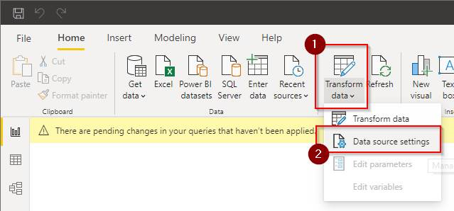
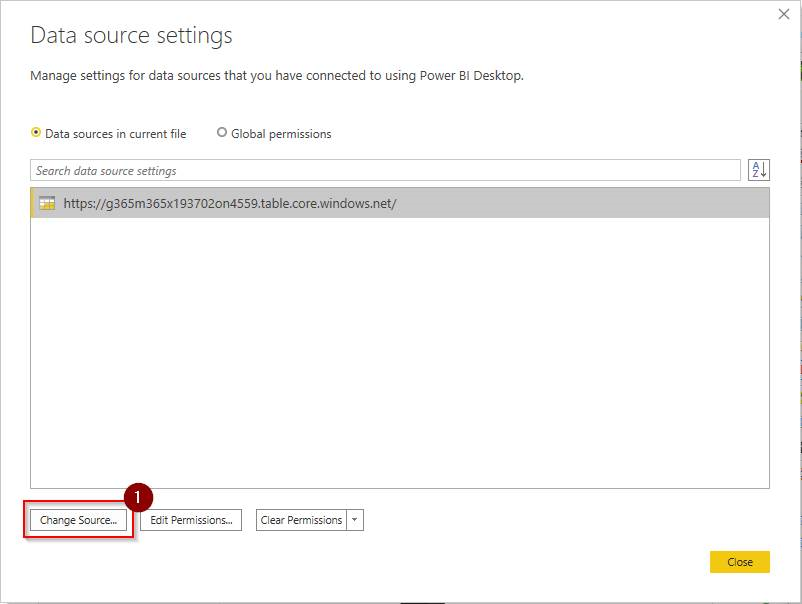

# Change PowerBI Data Source Settings

- Open the sample dashboard and navigate to _Transform Data_ | _Data source settings_.

- Select _Change Source_ and input the storage account data you received by mail.

## Quick navigation

[ReadMe](https://github.com/delegate365/GovernanceToolkit365/) &middot; [API](./API.md) &middot; [API-Create-App](./API-create-app.md) &middot; [API-Provisioning](./API-provisioning.md) &middot; [API-Provisioning-Flow](./API-provisioning-flow.md) &middot; [API-Invite-Guests](./API-invite-guest.md) &middot; [Newsletter](./newsletter.md) &middot; [Power-BI](./power-bi.md) &middot; [GT365](https://governancetoolkit365.com/)
