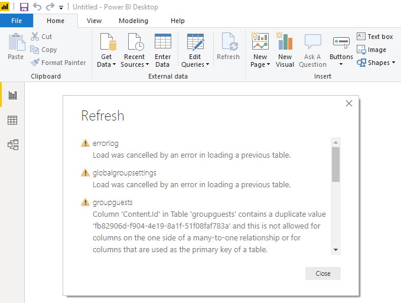
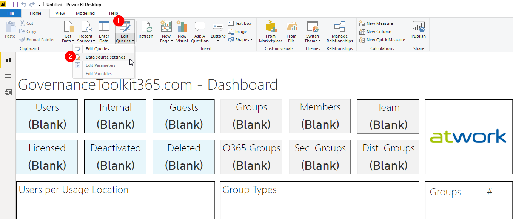
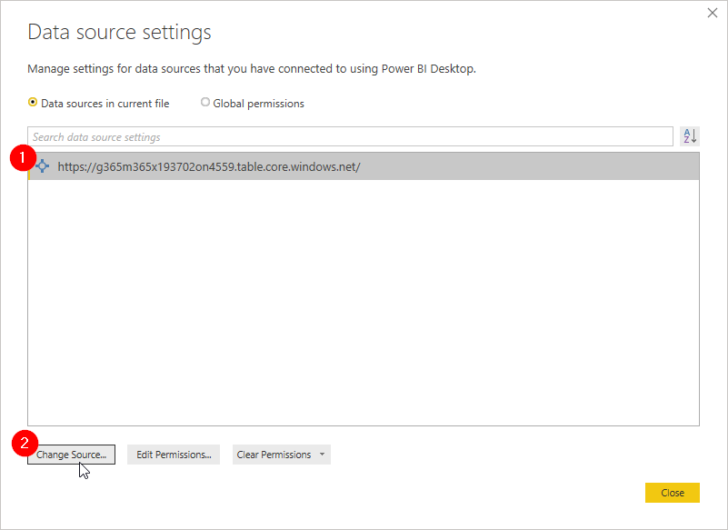
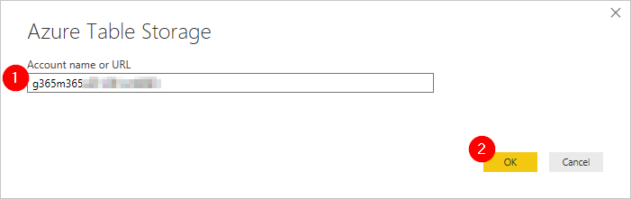
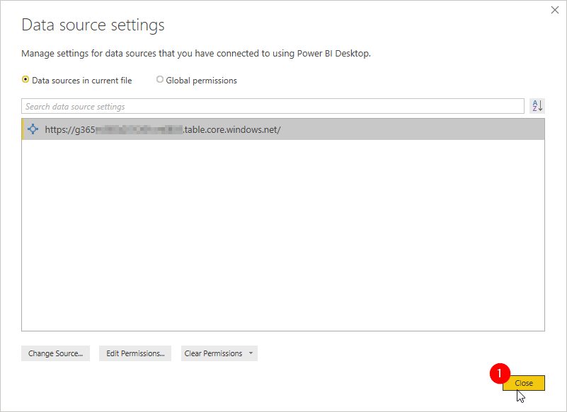
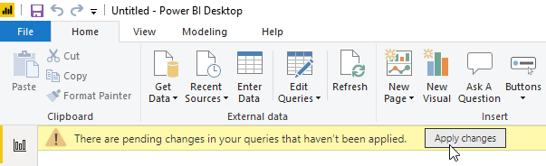
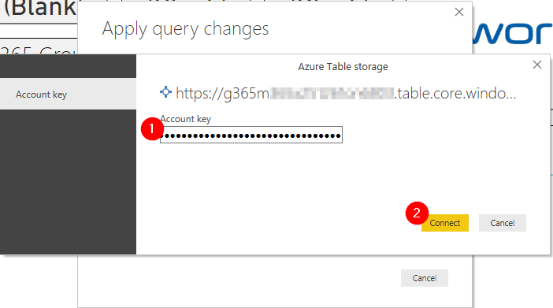
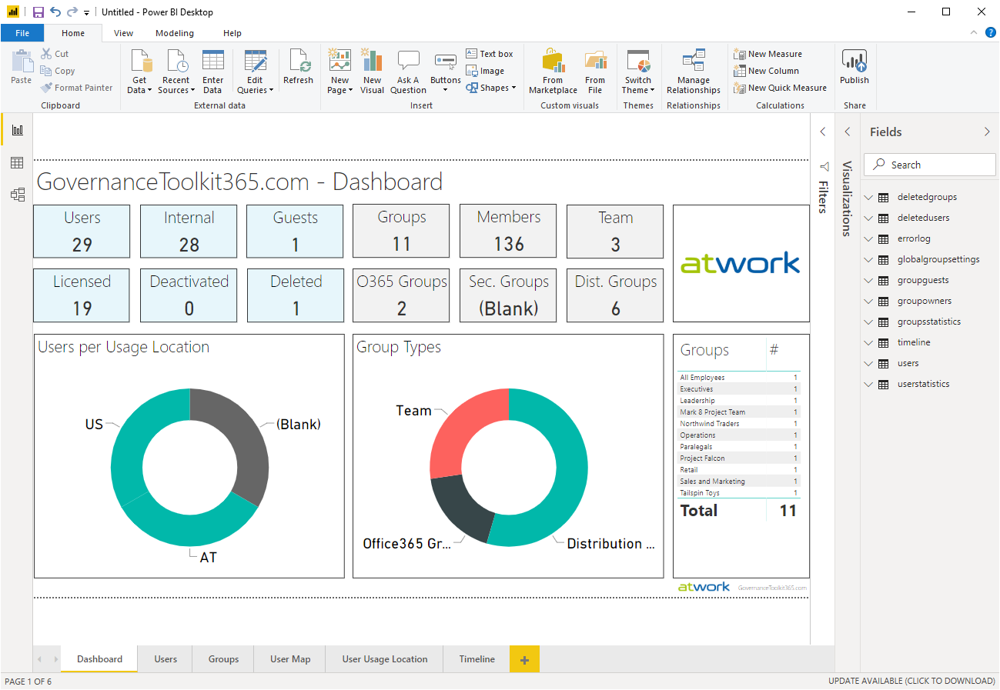
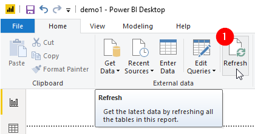

# Power-BI

These pages inform about how to use the Governance Toolkit 365 (GT365) with Microsoft Power-BI.

You can download the desktop client at the [Power-BI website](https://powerbi.microsoft.com/en-us/downloads/). You can download a GT365 dashboard sample zip-file from [here](https://governancetoolkit365.com/download/GovernanceToolkit365-Template.zip).

We assume, the data for your tenant has already been generated, and you have got the Azure Storage Account name and key. You need that data to access your generated statistics.

## Connect to your data

Follow these steps to get your own data visualized in Power-BI.

- Extract the [zip file](https://governancetoolkit365.com/download/GovernanceToolkit365-Template.zip).
- Open the dashboard file *GovernanceToolkit365-Template.pbit* with your Power-BI desktop client. When Power-BI tries to update the content, an error can occur. If this message happens, simply click on "Close".

- Now, let´s connect to your custom data source. Click on the "Edit queries" icon in the ribbon and select "Data source settings".

- Select the existing data source and click "Change Source..."

- Copy the Azure Storage Account name into the "Account name or URL" field and click OK. You got en email with the subject "GT365: Your storage data..." including that data.

- Wait till the box closes. You will see the new data source. Then, close box with "Close".

- Confirm the changes with the "Apply changes" in the yellow message bar.

- Now, Power-BI will try to refresh the data. It will ask for the Storage Account key. Add that key and click "Connect".  You got en email with the subject "GT365: Your storage data..." including that data.

- You should now see the to your own tenant data refreshed in the dashboards.

- Save the file locally.
- Adapt the Power-BI dashboard as needed and save any changes.
- Publish it to the Power-BI portal to an Office 365 Group. Done.

Of course, you can create your own, custom Power-BI dashboard from a blank Power-BI file. Connect to your storage as described above.

## Refresh
  
You can refresh the visualization in Power-BI anytime by clicking on the "refresh" button in the ribbon.

Keep in mind, that the data will be renewed every night. So, refreshing during the day only makes sence once. In the dashboards, you see the data from the previous day.

## Samples

See some sample dashboards here: 

Develop your own dashboards with the data provided.

**Quick navigation**

[ReadMe](https://github.com/delegate365/GovernanceToolkit365/) &middot; [API](./API.md) &middot; [API-Create-App](./API-create-app.md) &middot; [API-Provisioning](./API-provisioning.md) &middot; [API-Provisioning-Flow](./API-provisioning-flow.md) &middot; [API-Invite-Guests](./API-invite-guest.md) &middot; [Newsletter](./newsletter.md) &middot; [Power-BI](./power-bi.md) &middot; [GT365](https://governancetoolkit365.com/)
